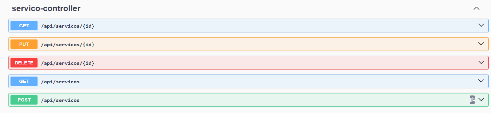
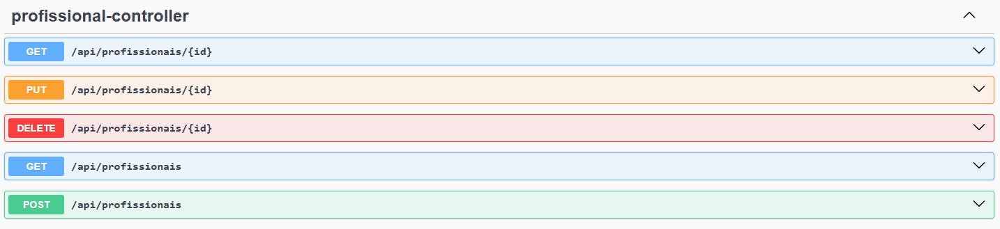
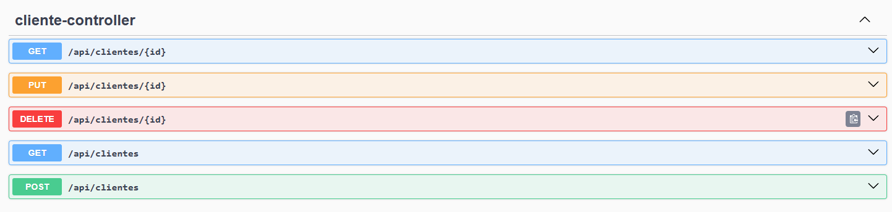
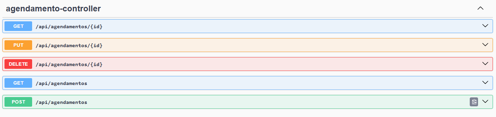
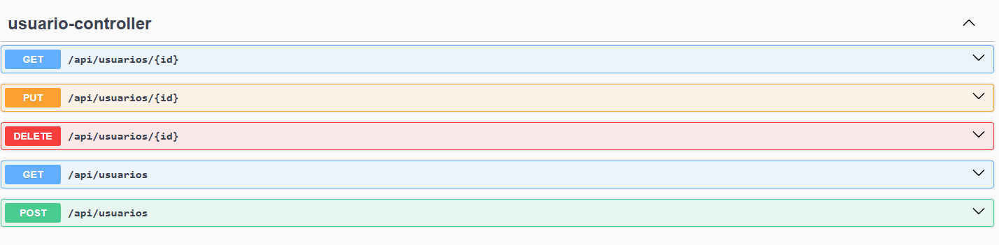

Nome do Projeto (Insira aqui)
Este projeto consiste em uma API RESTful desenvolvida em Java com Spring Boot, focada no gerenciamento de agendamentos, serviços, profissionais e clientes. O projeto utiliza o Swagger UI para documentação interativa e testes dos endpoints.

🚀 Tecnologias Utilizadas
Linguagem: Java

Framework: Spring Boot

Documentação: Swagger/OpenAPI

📖 Funcionalidades (Endpoints)
A API está organizada nos seguintes controladores:

1. servico-controller
   Gerencia o catálogo de serviços oferecidos.

2. profissional-controller
   Gerencia o cadastro dos profissionais.

3. cliente-controller
   Gerencia o cadastro dos clientes.

4. agendamento-controller
   Gerencia a lógica de negócio principal: o agendamento de serviços.

5. usuario-controller
   Gerencia o acesso e autenticação dos usuários do sistema.

